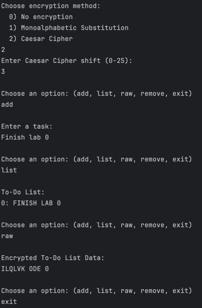

# Lab 0

### Author: Nejintev Nicolai, FAF-221

### Task

Implement 2 SOLID letters in a simple project.

### Implementation

I created a simple CLI application that stores an encrypted To-Do List in memory.

Run with this command:
```bash
mvn package -Dlab=0 && java -jar ./target/lab0.jar 
 ```

### SOLID Principles Used

- **Single Responsibility Principle**: No class does two things at the same time.  
  Class `ToDoList` does not do encryption, and classes `CaesarCipher`, `DummyCipher` don't do storage.
- **Dependency Inversion Principle**: The `CLI` class depends on the abstraction (`EncryptionMethod` interface) and not
  on the implementation. This allows for implementation decision in runtime.

### Results, Conclusions



