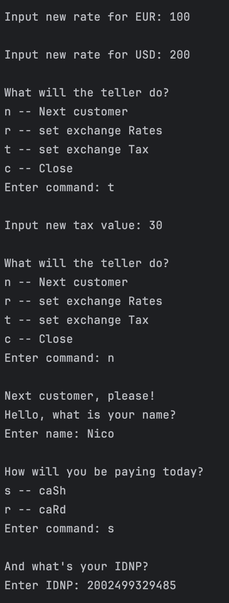
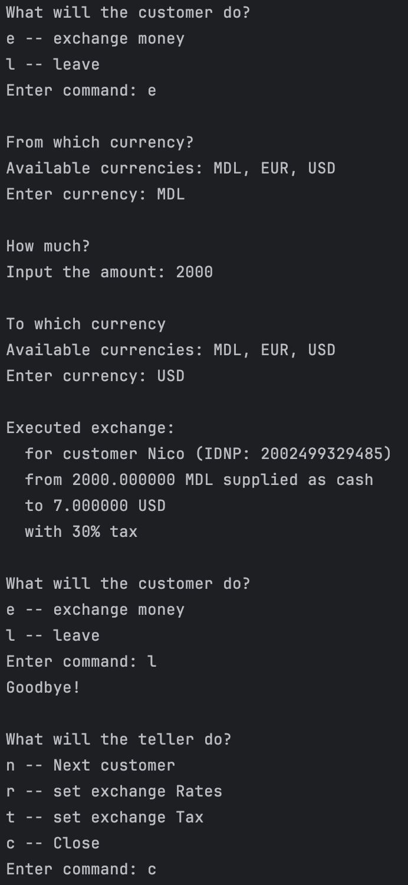

# Creational Design Patterns


## Author: Nejințev Nicolai

----

## Objectives:

* Get familiar with the Creational DPs;
* Choose a specific domain;
* Implement at least 3 CDPs for the specific domain;

## Used Design Patterns:

* Singleton
* Builder
* Factory Method

## Implementation

I have created a currency exchange system with:

* RateService – a singleton that holds the exchange rates for different currencies.
* InvoiceBuilder – a builder with one implementation that builds valid invoices. 
  The invoices need to be paid with a Payment.
* Customer – a factory for payments with two implementations:
    * CashCustomer – creates CashPayments.
    * CardCustomer – creates CardPayments.
* ExchangeCLI – The client that ties everything together.

The InvoiceBuilder is created once by the ExchangeCLI, and then reused. The Customer object is recreated each time
a new customer interaction is started, but kept between exchanges by the same user.

Run with this command:
```bash
mvn package -Dlab=1 && java -jar ./target/lab1.jar 
 ```

### Snippets

**RateService Singleton**
```java
public class RateService {
    private static RateService instance;
    private final HashMap<Currency, Float> rates;
    
    private RateService() {
        this.rates = new HashMap<>();
        this.rates.put(Currency.MDL, 1F);
    }

    public static RateService getInstance() {
        if (instance == null) {
            instance = new RateService();
        }
        return instance;
    }

    public float getRate(Currency currency) { /* ... */ }
    public void setRate(Currency currency, float rate) { /* ... */ }
}
```

**InvoiceBuilder and Customer Usage**

```java
Invoice invoice = this.invoiceBuilder.
        reset().
        setAmount(amount).
        setOriginCurrency(origin).
        setTargetCurrency(target).
        setTax(this.tax).
        getResult();

customer.createPayment(invoice).execute();
```


## Conclusions / Screenshots / Results

Using Creation Design Patterns makes the structure of the project more complex. But this way, the complexity is hidden
in the implementation, and the client can use a simple abstraction API. 

Using these patterns comes at a cost. If the client logic is simple as-is, it will only complicate the implementation,
without much benefit to the client code.


