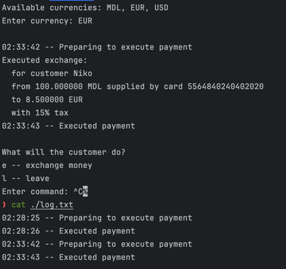

# Structural Design Patterns

## Author: Nejințev Nicolai

----

## Objectives:

1. Study and understand the Structural Design Patterns.
2. As a continuation of the previous laboratory work, think about the functionalities that your system will need to
   provide to the user.
3. Implement some additional functionalities using structural design patterns.

## Used Design Patterns:

* Facade
* Proxy
* Adapter

## Implementation

I have modified the currency exchange system with:

* StdOutLogger, RemoteLogger – logging destination that implement a common logging interface.
* LegacyFileLogger – logging destination that does not implement the common interface.
* FileLoggerAdapter – adapts the LegacyFileLogger to the logging interface.
* EverywhereLogger – a facade that combines and manages all 3 logging destinations.
* LoggedPayment – a proxy that creates a log entry before and after a payment is executed.

Run with this command:

```bash
mvn package -Dlab=2 && java -jar ./target/lab2.jar 
 ```

### Snippets

**LegacyFileLogger Adapter**

```java
public class FileLoggerAdapter implements Logger {
    private final LegacyFileLogger logger;

    public FileLoggerAdapter(LegacyFileLogger logger) {
        this.logger = logger;
    }

    public void log(String... msg) {
        String logStr = "";
        logStr += new SimpleDateFormat("hh:mm:ss").format(new Date());
        logStr += " -- ";
        logStr += String.join(" ", msg);
        logStr += "\n";

        this.logger.logToFile(logStr);
    }
    /* ... */
}
```

The adapter takes a reference to the legacy file logger, and wraps it with the methods defined in the Logger interface.
Legacy logger expects one string, already with date. The new interface allows for a variable amount of arguments, and
automatically adds the timestamp.

**LoggedPayment Proxy**

```java
public class LoggedPayment implements Payment {
    private final Logger logger;
    private final Payment payment;

    public LoggedPayment(Logger logger, Payment payment) {
        this.logger = logger;
        this.payment = payment;
    }

    public void execute() {
        this.logger.log("Preparing to execute payment");
        this.payment.execute();
        this.logger.log("Executed payment");
    }
}
```

The proxy implements the same interface as a regular payment, but executes additional actions before and after
the execution.

## Conclusions / Screenshots / Results

Structural patterns help a lot when you need to integrate multiple existing packages, each with its own API,
in one project. They allow to expand functionality of a class, without changing the way you interact with it,
even in runtime. In general, structural patterns are useful when you need to put something in between the class
and its user.


